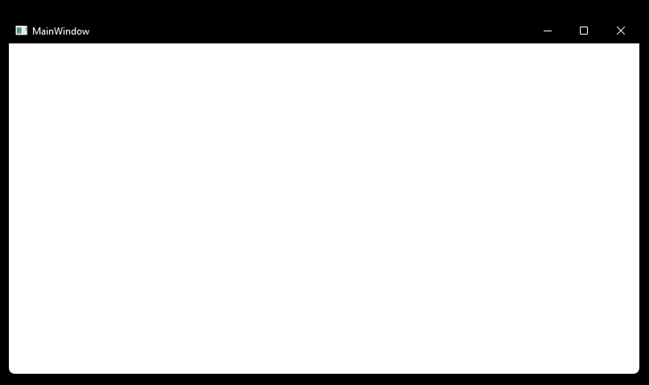

# WPF_Test_Puzzle
This repository is a mono repository contains three wpf test applications.

Two of them are puzzles to solve one being simple the second being complex. Perfect for testing windows ui automation modules and for testing simple decision making processes. There is also a blocker window called Notifier, which closes itself after some time. It can be used to hinder the testing process, by appearing in front of other items randomly, to assure the stability of the automation process.

## Test case descriptions 

| **Simple test case**

**Testing Steps**:

1. Open Application
1. Switch To Stage 1
1. Switch username with password\

1. Click Input
2. Copy Flag 1\

2. Close Popup
3. Switch Stage 2
4. Check The First Putme If The First Solution Is Checked
5. Check The Second Putme If The Second Solution Is Checked
6. Check The Third Putme If The Third Solution Is Checked\

7. Click Input
8. Copy Flag 2\

9.  Close Popup
10. Switch To Stage 3
11. Paste Flag 1
12. Paste Flag 2\

13. Congratulation Should Appear\

14. Close Popup
15. Close Appplication

| **Complex test case**

**Testing Steps**:

1. Open Application
1. Check the table as valid or invalid according to the following rules
   - If there are 4 in row and 4 in column ticks then check table as valid.
   - Else If there are 4 in positive diagonal ticks and 4 in negative diagonal then check the table as valid
   - Else there will be no 4 in row and column or 4 in both diagonals then check the table as invalid\

1. Check the right login state according to the following rules
   - Check Username as Invalid if the username is invalid\

   - Check login as invalid if password is invalid but username was valid\

   - Check Login as valid if both username and password are valid\

1. Click Input
1. Congratulation Should Appear\

1. Close Popup
1. Close Application

| **Notifier** 

Notifier application is an empty windows window which is intended to use to cover and block other elements on windows desktop.\

Open the application and one second after loading the window it will close itself.